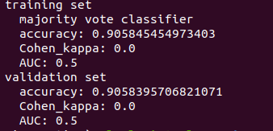
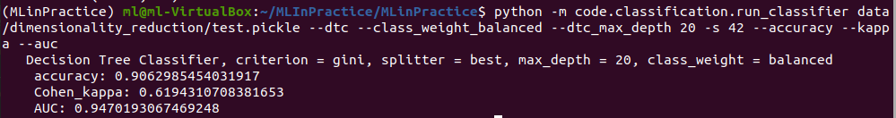
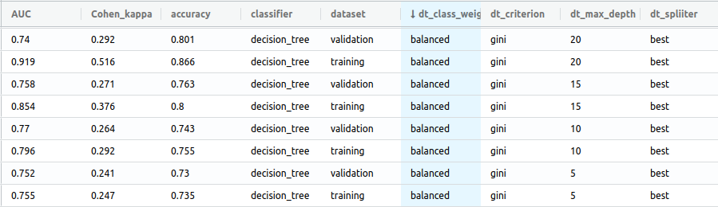
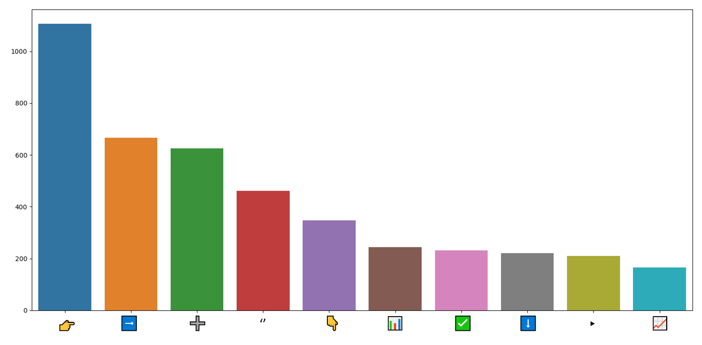
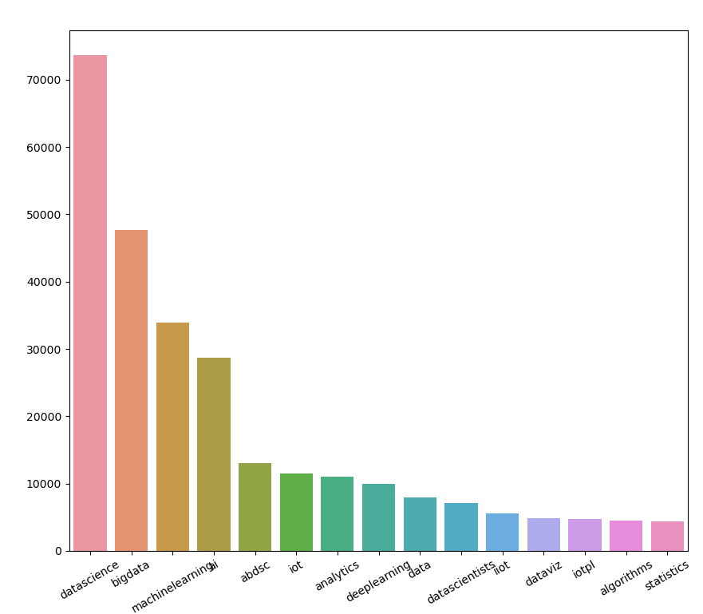
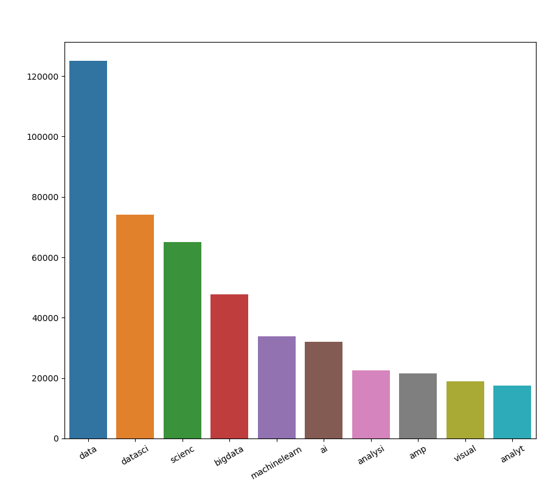
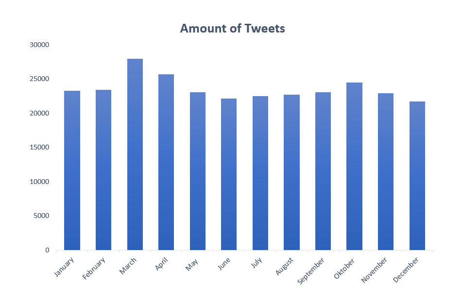
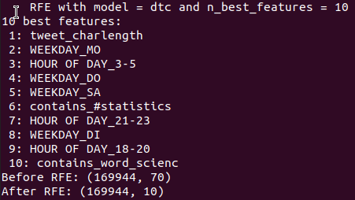
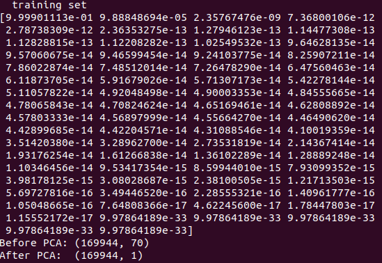
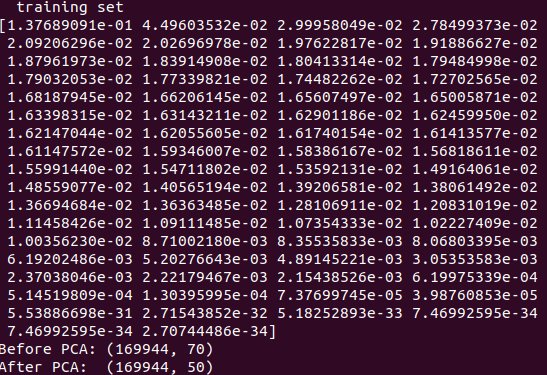

Machine Learning in Practice (Group HumbleBees 777, Qirui Zhu, Frederik Wollatz, Xi Cheng)

## General documenation

### Setup
1. Setup environment and working tools (incl. Jamovi for dataset exploration) (211004)
2. Defined labeling/color coding convention used on Trello (211004)
3. Explored dataset and listed features that could be used later for model building and experiments (incl. filtering out non-english tweets) (211004)
4. created 'Documentation.md' (211005)
5. clean code: defined naming conventions that shall be used consistently throughout the project (incl. variable names and function names)

### Implementation Checklist - Preprocessing & Feature Extraction
1. Updated corresponding shell scripts
2. Wrote new unit test
3. Updated ReadMe.md and Documentation.md
4. Executed corresponding shell script
5. Run `test/run_tests.sh`

## Test Strategy

### Test Agreements

Only components from the preprocessing and feature_extraction parts will be covered by unit tests, since
the behaviour of these parts are well specify-able and testable. The other parts (evaluation, dimensionality reduction)
are mostly based on external 3rd party components (e.g. `sklearn`) and thus hard to test. 

1. TestCases should named as boolean outcomes (e.g. def this_class_works: => y/n)

2. TestCases should start with "test_" (in order to work with the `run_test.sh`

3. Having a seperate test python file per class/components

4. Tests are grouped in a seperate "test" folder

5. Group Tests in 3 steps:
  - (I) Arrange: set up of the test => variables, environment (excluding imports)
  - (II) Act: perform the task => e.g. testing tokenizer put all tokenizing code in here
  - (III) Assert: assertion code in here
	
    
Example:

````
def test_tokenization_single_sentence_is_working(self):
    #arrange
    input_text = "This is an example sentence"
    output_text = "['This', 'is', 'an', 'example', 'sentence']"
    input_df = pd.DataFrame()
    input_df[self.INPUT_COLUMN] = [input_text]

    #act
    tokenized = self.tokenizer.fit_transform(input_df)

    #assert
    self.assertEqual(tokenized[self.OUTPUT_COLUMN][0], output_text)
````
    
6.) Run `test/run_tests.sh`

## Evaluation

### Design Decisions

- Accuracy: to easily compare scores with baseline classifier (majority vote classifier was used here).
- Top K Accuracy score: originally implement for performing multiclass prediction. But now since do bi-class prediction, this metric is not useful anymore.
- Confusion matrix: not a concrete score, but the possibility to get the confusion matrix which some the metrics are based on
- Cohen's Kappa: good performance indication for imbalanced-datasets.
- AUC (Area under the ROC Curve): an aggregate measure of performance across all possible classification thresholds. The higher the score, the better the performance is. 0.5 shows that the classifier does not learn any discriminant features of positive and negative classes while 1 indicates an optimal performance.


### Results

The baseline classifier was majority vote classifier. On the training set, the accuracy achieved was 0.9058, Cohen's Kappa was 0 and AUC was 0.5. On the validation set, the accuracy achieved was 0.9058, Cohen's Kappa was 0 and AUC was 0.5. Always-true classifier was also implemented.



More details on the classifiers will be illustrated later in the Classifier section. 

All results of the trained classifier could be viewed with:
`mlflow ui --backend-store-uri data/classification/mlflow`

Perform classification with the aforementioned best decision tree parameter configuration, we achieve the following results on the untouched test set.  


### Interpretation

Accuracy was based on the majority class, which showed the imbalance in the dataset. It was also reflected by Cohen's Kappa. Futhermore, AUC indicated that the classifier has no discrimination capacity to distinguish between positive and negative classes.

The classifier that delivered the best results on the validation set was the decision tree classifier, with the balanced class weight option, gini criterion, max depth of 20 and best splitter. The results were detailed in the following table.



As one can see Cohen's Kappa was still pretty low on the validation set while high on the training set for the best classifier. It indicates overfitting of this classifier. 
Increasing the max depth led to stronger overfitting (the margin between the Cohen´s kappe scores increases with increasing depth). The differences in AUC score also confirmed the observation.

## Preprocessing

### Design Decisions

As for the general/classic preprocessing, we decided on well-known NLP preprocessing steps to remove redundancy, 
data that does not convey useful information (e.g. stop words), and tweet specific contents (like urls and emoji) to
preprocess the tweet text itself into plain textualized information. The general preprocessing includes lower casing, 
language filtering, stop word removal, punctuation removal (already given), emoji and url filtering and tokenization.
All intermediate results are stored in separate columns and are thus a accessible for the feature extraction. 

In addition to preprocessing the tweet text itself, for each tweets the emojis were extracted for further
feature extraction.

### Results

Example Preprocessing of one tweet:

Before Preprocessing:

`"Courses@CRG: Containers &amp; #Nextflow  Slow-paced hands-on course designed for absolute beginners who want to start using #containers and @nextflowio pipelines to achieve #reproducibility of data analysis #VEISris3cat #FEDERrecerca #Docker #CloudComputing  ➡️ https://t.co/HxbfIdZVyl  https://t.co/1kGRujM5vB""Courses@CRG: Containers &amp; #Nextflow  Slow-paced hands-on course designed for absolute beginners who want to start using #containers and @nextflowio pipelines to achieve #reproducibility of data analysis #VEISris3cat #FEDERrecerca #Docker #CloudComputing  ➡️ https://t.co/HxbfIdZVyl  https://t.co/1kGRujM5vB"`

After Preprocessing:

`"['coursescrg', 'contain', 'amp', 'nextflow', 'slowpac', 'handson', 'cours', 'design', 'absolut', 'beginn', 'want', 'start', 'use', 'contain', 'nextflowio', 'pipelin', 'achiev', 'reproduc', 'data', 'analysi', 'veisris3cat', 'federrecerca', 'docker', 'cloudcomput']"`

Emojis equals `[➡]`. 

## Feature Extraction

### Design Decisions

The features implemented are:
- the most common hastags (boolean): determine the n (specifyable) most common hashtags and checks for the existence of these words in the tweet. This creates n new features for each word.
- the most common emojis (boolean): determine the n (specifyable) most common emojis and checks for the existence of these emojis in the tweet. This creates n new features for each emoji.
- character length (implemented previously, int): the length of the unpreprocessed tweet. 
- the amount of followers (int): make use of the twitter API to get the follower count of the person which the tweets belongs to.
- the number of urls (int): determines how many urls were shared in the tweet. As it brings new information to the followers, it has the potential of being retweeted in the social circle. 
- the most common words (str): certain popular or catchy words could attract more views and therefore retweets.
- the number of hashtags (int): the more hashtags, the more likely that a tweet gets identified by the search function. It therefore increases the chance of being discovered by the community and being retweeted.
- if any photos were attached: photos as visual stimuli could play an important role in catching people's attention and in attracting others to spend more time on the tweets.
- the number of words (int): directly influences how much content the person could send out in one tweet. A high number indicates more content, while a small number indicates little content
- the unix time when tweets were published (int):the unix-time when the tweet was published serves as indicator when in the complete timeline of all these tweets, it was posted. Thereby it might be possible for the classifier to find trending topics/hashtags/etc.
- the month, weekday, hour (one-hot-encoded booleans): the *month* that the post was send in, could be related to how many people see the tweet. In December or the summer months, when people usually go on vacation, might lead to more people on twitter in general, because of more spare time.
The *weekday*, similar to the *month*, with people having more time to read through twitter on the weekend. The *hour of the day* is grouped in blocks of 3 hours. It could show tendencies of people using plattforms like twitter more commonly in the afternoon/evening, than during typical working-hours 
- The sentiment: indicated by the vader-module by nltk, shows if the language is more positive or more negative. This could result in a more positive/negative mindset of the reader, and therefore in a higher chance of getting shared.

### Results

Can you say something about how the feature values are distributed? Maybe show some plots?

Here we present some distributional data / plots from some of the features we extracted:

#### 1.) Top 10 most common emojis w.r.t. their count over all tweets



The top emojis were mostly used to point towards a link.

#### 2.) Top 15 most common hashtags w.r.t. their count over all tweets



#### 3.) Top 10 most common words w.r.t. their counter over all preprocessed tweets



Both the most common hashtags and most common words indicate that especially topics like "data science" and "machine learning" were the most common.

#### 4.) Amount of tweets per month



Overall the amount of tweets per month stays on similar levels throughout a year, with some small exceptions (March and April)

#### 5.) Some more descriptive statistics of our numerical features


The high standard deviation and Mean compared to the relatively low follower count leads to the conclusion, that we have outliers, that increase the mean significantly. The high number of the maximum indicates 130 096 880 is the maximum amount of followers, that one person has. This is a huge part of the 206 000 000 Users, 
[that are actively using twitter](https://www.statista.com/statistics/242606/number-of-active-twitter-users-in-selected-countries/#:~:text=Global%20Twitter%20usage,former%20U.S.%20president%20Barack%20Obama.).
The Sentiment value shows that the texts in general tend to be on the more positive site.
Every tweet uses round about 1 URL and 3 Hashtags and consists of about 15-Words and 178 characters.

### Interpretation

Can we already guess which features may be more useful than others?

The following features may be more useful: the amount of followers. 

The above features were chosen because we believed that they would play a role collectively in determining the virality of tweets. And we expected the amount of followers to be more important. 

## Dimensionality Reduction

If you didn't use any because you have only few features, just state that here.
In that case, you can nevertheless apply some dimensionality reduction in order
to analyze how helpful the individual features are during classification

### Design Decisions

Which dimensionality reduction technique(s) did you pick and why?

It was originally decided to choose three dimensionality reduction methods. And the following dimensionality reduction techniques were used:
- PCA: used to perform feature projection and to compute new features based on the original ones; this approach select a number of principle components automatically based on the accumulative explained variance ratio (currently 0.95). We normalize or standardize the features before performing PCA.
- Wrapper (RFE) method: used for feature selection based on the models that evaluated different features; the number of selectable features could be specified.
- Filter method: instead of using models, the mutual information heuristics were used to select suitable features; the number of selectable features could be specified.

### Results

Which features were selected / created? Do you have any scores to report?

Perform dimensionality reduction using the RFE wrapper method with the n = 10 best features and the DTC model:



We choosed these RFE settings as dimensionality reduction technic before attending to the hyper-parameter optimization.

Here are also some PCA scores, but due to compatibility issue between PCA and the Complement Naive Bayes Classifier (does not allow for negative feature values) we decided against the PCA usage for the hyper-parameter optimization.

1.) PCA scores with Normalization



Here we can see that the first component is already enough to cover more than 95 % of the explained variance

2.) PCA scores with Standardization



While using standardization instead of normalization, we need the top 50 components to reach an explained variance of above 95%,
indicating that standardization might made the features more comparable as mere normalization.

### Interpretation

The results of the RFE feature selection indicates that especially boolean features very more important.
This could be due to the chosen DTC model which sees boolean features more useful to form distinct target groups.
Still the top feature was a numerical one `tweet_charlength`, so the length of the tweet was considered the most important 
along the boolean features. Surprisingly the dimensionality reduction indicated that the amount of followers was not as useful as we thought.

## Classification

### Design Decisions

Which classifier(s) did you use? Which hyperparameter(s) (with their respective
candidate values) did you look at? What were your reasons for this?

The following classifiers were used:
- majority vote classifier: parameters - `seed`
  - intended to be used as a baseline classifier
- label frequency classifier: parameters - `seed`
  - a second baseline classifier option
- minority vote classifier: parameters - `seed`
  - implemented out of curiosity of using a minority classifier as baseline, but dismissed due to poor performance
- k-nearest neighbor classifier: parameters - `k`
- complement naive bayes: parameters - `alpha`, `fit_prior`, `norm`
    - it was chosen because it is known to work with an imbalanced dataset like the current dataset
- decision tree classifier: parameters - `criterion`, `splitter`, `max_depth`, `class_weight`
  - `max_depth`: to limit the tree in depth. Used for investigating overfitting issues
  - `criterion`: use a different quality measure for the splits. We introduced the entropy option to use the information gain instead of the gini impurity
  - `splitter`: use a different split strategy. We introduced the random option to use instead of the best split with the hope to tackle overfitting.
  - `class_weight`: we introduced this option to tackle the imbalance problem of the dataset.
- random forest classifier: parameters - `criterion`, `bootstrap`, `max_depth`, `n_estimators`, `class_weight`
  - `criterion`: same reasoning as for the decision tree classifier
  - `max_depth`: same reasoning as for the decision tree classifier
  - `n_estimators`: choose the number of trees/estimators in the forest. Introduced for investigating effects on overfitting and performance.
  - `class_weight`: same reasoning as for the decision tree classifier
  - `bootstrap`: whether to use the whole dataset to build each tree or sample a subset of it for each tree.
  - Unfortunately due to file size restriction were not able to observe results for optimizing the parameters of this classifier
- support vector classifier: parameters - `c`, `gamma`, `kernel`
  - it was chosen as it is effective in high dimensional space. Yet, possibly due to the large number of data points, the required training time was significantly higher than anticipated. Eventually, due to the grid wall time, the trainings were terminated and we had to abandon svc.
  - GridSearchCV was used for hyper-parameter tuning. For each combination of the values of *c*, *gamma*, and the choices of *kernel*, a svc model is evaluated. It took significantly more time than expected on IKW grid to evaluate even a model with one combination (roughly at least one hour). We had to abandon the grid search of svc in the end.
  - `c`: the penalty parameter that represents misclassification or error term. For the grid search, {0.1, 1, 10, 100} was tested.
  - `gamma`: determines how much the curvature is desired at a decision boundary. For the grid search, {1, 0.1, 0.01, 0.001} was tested.
  - `kernel`: to takes the data points from the original lower dimensional space and returns the transformed vectors in the higher dimensional feature space. For the grid search, {'rbf', 'poly', 'sigmoid'} were tested.
  

### Results

The performance of random forest classifier and support vector classifier could not be optimized because the first one was too large to be pushed to git while the latter took too long for classification. For the remaining classifiers, the decision classifier performs the best, followed by the k-nearest neighbor classifier, complement naive bayes classifier, majority-/minority-vote and label frequency classifier in this order. The last three classifiers were of similar performance. Details were summarized in the mlflow table. 

In general, nearly all the classifiers were overfitting the training set. The decision tree classifier generailzed better compared to other classifier, even though it could be optimized further. 

Here is the configuration and the result of our best classifier again:


For the hyper-parameter optimization the following script shows our predefined hyper-parameter value range, we explored `code/classification/grid_search.sh`:

````shell
#!/bin/bash

mkdir -p data/classification

# specify hyperparameter values
values_of_k=("1 2 3 4 5 6 7 8 9 10")
values_of_dtc_maxdepth=("None 5 10 15 20")
values_of_cnb_alpha=("0.05 0.15 0.30 0.50 0.70 0.85 0.95 1.0")
values_of_svc_C=("0.1 1 10 100")
values_of_svc_Gamma=("1 0.1 0.01 0.001")
values_of_svc_kernel=("rbf poly sigmoid")

# different execution modes
if [ $1 = local ]
then
    echo "[local execution]"
    cmd="code/classification/classifier.sge"
elif [ $1 = grid ]
then
    echo "[grid execution]"
    cmd="qsub code/classification/classifier.sge"
else
    echo "[ERROR! Argument not supported!]"
    exit 1
fi

# do the grid search 
# KNN
echo "Optimizing KNN Classifier"
for k in $values_of_k
do
    echo "KNN k={$k}"
    $cmd 'data/classification/clf_KNN_'"$k"'.pickle' --knn $k -s 42 --accuracy --kappa --auc
done

#Decision Tree Classifier
echo "Optimizing Decision Tree Classifier"
for depth in $values_of_dtc_maxdepth
do
    echo "DTC max_depth={$depth}"
    $cmd 'data/classification/clf_DTC_'"$depth"'.pickle' --dtc --dtc_max_depth $depth -s 42 --accuracy --kappa --auc
    #running with random splitter
    $cmd 'data/classification/clf_DTC_'"$depth"'_random_splitter.pickle' --dtc --dtc_max_depth $depth --dtc_splitter_random -s 42 --accuracy --kappa --auc
    #running with entropy criterion
    $cmd 'data/classification/clf_DTC_'"$depth"'_criterion_entropy.pickle' --dtc --dtc_max_depth $depth --dtc_criterion_entropy -s 42 --accuracy --kappa --auc
    #running with balanced weight option
    $cmd 'data/classification/clf_DTC_'"$depth"'_class_weight_balanced.pickle' --dtc --dtc_max_depth $depth --class_weight_balanced -s 42 --accuracy --kappa --auc
done

#Random Forest Classifier: Not optimized due to git large file issues

#Naive Bayes Classifier
echo "Optimizing Complement Naive Bayes Classifier"
for alpha in $values_of_cnb_alpha
do
    echo "CNB alpha={$alpha}"
    $cmd 'data/classification/clf_CNB_'"$alpha"'.pickle' -cnb --complement_naive_bayes_alpha $alpha -s 42 --accuracy --kappa --auc
    #running with fit prior
    $cmd 'data/classification/clf_CNB_'"$alpha"'_fit_prior.pickle' -cnb --complement_naive_bayes_alpha $alpha --complement_naive_bayes_fit_prior -s 42 --accuracy --kappa --auc
    #running without normalization
    $cmd 'data/classification/clf_CNB_'"$alpha"'_without_norm.pickle' -cnb --complement_naive_bayes_alpha $alpha --complement_naive_bayes_norm -s 42 --accuracy --kappa --auc
done

#Support Vector Classifier
echo "Optimizing Support Vector Classifier"

for kernel in $values_of_svc_kernel
do
    for c_value in $values_of_svc_C
    do
        for gamma_value in $values_of_svc_Gamma
        do
            echo "SVC kernel={$kernel}, c={$c_value}, gamma={$gamma_value}"
            $cmd 'data/classification/clf_SVC.pickle' --svc --svc_c $c_value --svc_kernel $kernel --svc_gamma $gamma_value -s 42 --accuracy --kappa --auc
        done
    done
done


````

### Interpretation

We suspected that the decision tree classifier performed the best because the dimensionality reduction was performed using a decision tree model.
The best classifier managed to score at around 80% on the validation set but still the Cohen's Kappa score of 0.292 indicated that overfitting persisted and further optimization was needed.
As seen in the above run on the test set, surprisingly the classifier performs well better reaching a accuracy of 0.9063 (on a par with the baseline majority vote classifier), but
with a much higher Cohen´s Kappa score of 0.61 (compared to 0.0 of the baseline). The AUC score of 0.9470 indicates that this classifier is indeed usable to a certain extent.
However, further research has to be done w.r.t. the influence of the dimensionality reduction on the classification results.
Additionally we are still unsure about why the boolean features were deemed more promising than expected compared to the
numerical features (e.g. follower count).

Lastly, below is a consolidated list of additional observations we made during the experiments:
- adjusting alpha value did not impact the performance of cnb classifier;
- as cnb does not take negative values, pca could not be applied beforehand for this classifier;
- svc seemed to not handle the huge amount of input data well. Classification took over 90 minutes.

## Appendix

This section, we added after conducting the actual experiments. After looking into the RFE ranking of our feature reduction part again,
we observed that somehow `sklearn.feature_selection.RFE` does assign multiple features to one ranking spot. For instance, the ranking for our features after performing is as follows:

````
[RFE Rankings]
Feature: contains_#datascience, Ranking: 49
Feature: contains_#bigdata, Ranking: 33
Feature: contains_#machinelearning, Ranking: 48
Feature: contains_#ai, Ranking: 37
Feature: contains_#abdsc, Ranking: 18
Feature: contains_#iot, Ranking: 41
Feature: contains_#analytics, Ranking: 45
Feature: contains_#deeplearning, Ranking: 39
Feature: contains_#data, Ranking: 51
Feature: contains_#datascientists, Ranking: 40
Feature: contains_#iiot, Ranking: 50
Feature: contains_#dataviz, Ranking: 42
Feature: contains_#iotpl, Ranking: 52
Feature: contains_#algorithms, Ranking: 38
Feature: contains_#statistics, Ranking: 5
Feature: contains_emoji_👉, Ranking: 47
Feature: contains_emoji_➡️, Ranking: 59
Feature: contains_emoji_➕, Ranking: 54
Feature: contains_emoji_️, Ranking: 57
Feature: contains_emoji_👇, Ranking: 55
Feature: contains_emoji_📊, Ranking: 53
Feature: contains_emoji_✅, Ranking: 56
Feature: contains_emoji_⬇️, Ranking: 60
Feature: contains_emoji_▸, Ranking: 58
Feature: contains_emoji_📈, Ranking: 61
Feature: tweet_charlength, Ranking: 1
Feature: follower_count, Ranking: 1
Feature: URL_Count, Ranking: 1
Feature: Hashtag_Count, Ranking: 1
Feature: datetime_unix, Ranking: 1
Feature: MONTH_JA, Ranking: 25
Feature: MONTH_FEB, Ranking: 24
Feature: MONTH_MA, Ranking: 26
Feature: MONTH_APR, Ranking: 30
Feature: MONTH_MAI, Ranking: 35
Feature: MONTH_JUN, Ranking: 28
Feature: MONTH_JUL, Ranking: 27
Feature: MONTH_AUG, Ranking: 23
Feature: MONTH_SEP, Ranking: 32
Feature: MONTH_OKT, Ranking: 22
Feature: MONTH_NOV, Ranking: 19
Feature: MONTH_DEZ, Ranking: 31
Feature: WEEKDAY_MO, Ranking: 2
Feature: WEEKDAY_DI, Ranking: 12
Feature: WEEKDAY_MI, Ranking: 4
Feature: WEEKDAY_DO, Ranking: 7
Feature: WEEKDAY_FR, Ranking: 1
Feature: WEEKDAY_SA, Ranking: 6
Feature: WEEKDAY_SO, Ranking: 10
Feature: HOUR OF DAY_0-2, Ranking: 3
Feature: HOUR OF DAY_3-5, Ranking: 8
Feature: HOUR OF DAY_6-8, Ranking: 15
Feature: HOUR OF DAY_9-11, Ranking: 14
Feature: HOUR OF DAY_12-14, Ranking: 43
Feature: HOUR OF DAY_15-17, Ranking: 34
Feature: HOUR OF DAY_18-20, Ranking: 9
Feature: HOUR OF DAY_21-23, Ranking: 1
Feature: contain_photos, Ranking: 1
Feature: word_count, Ranking: 1
Feature: contains_word_data, Ranking: 13
Feature: contains_word_datasci, Ranking: 36
Feature: contains_word_scienc, Ranking: 11
Feature: contains_word_bigdata, Ranking: 46
Feature: contains_word_machinelearn, Ranking: 21
Feature: contains_word_ai, Ranking: 44
Feature: contains_word_analysi, Ranking: 29
Feature: contains_word_amp, Ranking: 16
Feature: contains_word_visual, Ranking: 20
Feature: contains_word_analyt, Ranking: 17
Feature: sentiment, Ranking: 1
````

Here we can see that multiple features are ranked on place one (also the numerical values we anticipated to be important).
This multi spot ranking changes our results fundamentally, since our RFE implementation was done under the assumption that
there is a distinct ranking. Therefore only the first feature on the first place were selected as number one, then the first features on the second place and so on.
Since we discovered this only after our experiments, we are lacking the time to rerun the hyper-parameter optimization and
to rewrite our existing documentation. Thus we decided to add this note as an appendix to our existing documentation. As an outlook,
the RFE components needs some small rework to include also the multiple ranking problem and the pipeline including the parameter optimization.
However this explains our scepticism towards the uselessness of our numerical features.